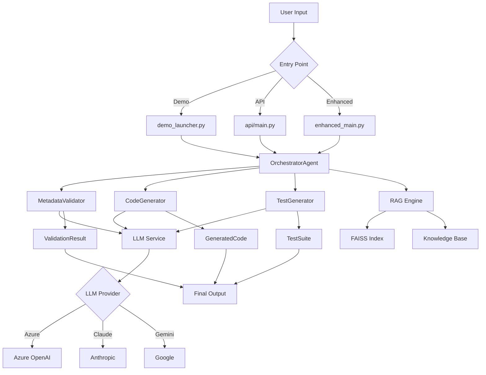
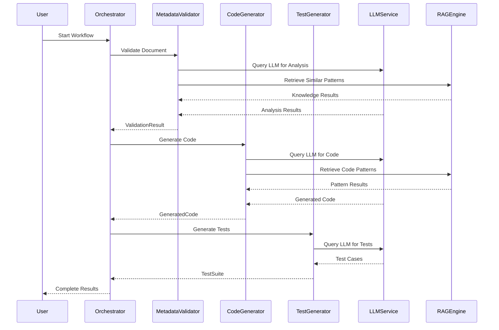
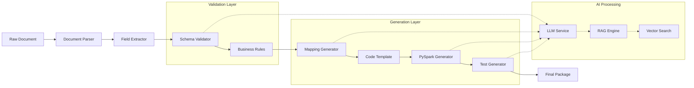
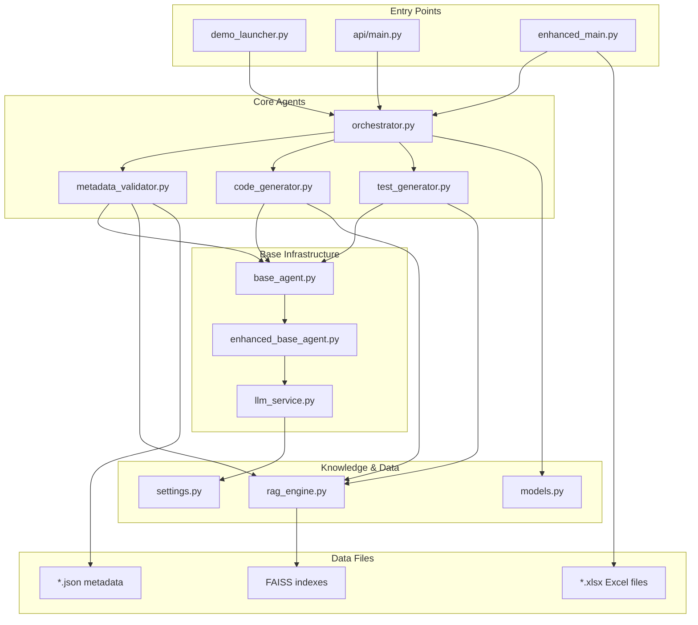

# 🔄 Data Flow Guide - Agentic Mapping AI Platform

## 📋 Overview

This document provides a comprehensive step-by-step breakdown of how data flows through the Agentic Mapping AI platform, including all files involved, method calls, and data transformations.

## 🎯 Main Data Flow Scenarios

### Scenario 1: Complete Agent Framework Demo
### Scenario 2: API-Based Processing
### Scenario 3: Enhanced Main Application
### Scenario 4: Individual Agent Operations

---

## 🚀 **Scenario 1: Complete Agent Framework Demo**

### **Entry Point**: `demo_launcher.py` → Option 1 (Agent Framework Demo)

```
User Input → demo_launcher.py → Agent Framework Demo
```

### **Step-by-Step Data Flow:**

#### **Step 1: Demo Initialization**
```
File: demo_launcher.py (lines 45-60)
├── User selects "1) Agent Framework Demo"
├── Calls: run_agent_framework_demo()
└── Loads: demo/results/*.json files
```

**Data Flow:**
```
User Selection → Menu Handler → Demo Loader → JSON Files
```

#### **Step 2: Agent Initialization**
```
File: agentic_mapping_ai/agents/orchestrator.py (lines 44-70)
├── Creates: OrchestratorAgent instance
├── Initializes: AgentConfig with model settings
├── Loads: LLM Service (llm_service.py)
└── Sets up: RAG Engine connection
```

**Data Flow:**
```
Demo Launcher → OrchestratorAgent.__init__() → AgentConfig → LLMService → RAGEngine
```

**Files Involved:**
- `agents/orchestrator.py` - Main orchestrator
- `agents/base_agent.py` - Base agent functionality  
- `llm_service.py` - Multi-LLM provider interface
- `knowledge/rag_engine.py` - Vector search engine
- `config/settings.py` - Configuration management

#### **Step 3: Multi-Agent Workflow Execution**
```
File: agentic_mapping_ai/agents/orchestrator.py (lines 150-200)
├── Step 3.1: Metadata Validation
├── Step 3.2: Code Generation  
├── Step 3.3: Test Generation
└── Step 3.4: Result Compilation
```

**Detailed Sub-Steps:**

##### **Step 3.1: Metadata Validation**
```
File: agents/metadata_validator.py (lines 50-120)
Method: validate_document_metadata()

Input Data: JSON/XML document
├── Parse document structure
├── Extract field definitions  
├── Validate data types
├── Check business rules
└── Generate validation report

Data Transformation:
Raw Document → Parsed Fields → Validated Schema → ValidationResult
```

**Code Path:**
```python
# File: agents/metadata_validator.py
def validate_document_metadata(self, document: Dict) -> ValidationResult:
    # Line 55: Parse document structure
    parsed_fields = self._parse_document_structure(document)
    
    # Line 70: Extract field definitions
    field_definitions = self._extract_field_definitions(parsed_fields)
    
    # Line 85: Validate against business rules
    validation_errors = self._validate_business_rules(field_definitions)
    
    # Line 100: Generate result
    return ValidationResult(
        is_valid=len(validation_errors) == 0,
        field_definitions=field_definitions,
        errors=validation_errors
    )
```

##### **Step 3.2: Code Generation**
```
File: agents/code_generator.py (lines 80-150)
Method: generate_transformation_code()

Input Data: ValidationResult + Mapping Rules
├── Analyze transformation requirements
├── Generate PySpark code templates
├── Apply business logic transformations
├── Add error handling and logging
└── Create production-ready code

Data Transformation:
ValidationResult → Code Templates → PySpark Code → GeneratedCode
```

**Code Path:**
```python
# File: agents/code_generator.py
def generate_transformation_code(self, request: CodeGenerationRequest) -> GeneratedCode:
    # Line 90: Analyze requirements
    requirements = self._analyze_transformation_requirements(request)
    
    # Line 105: Generate base template
    base_code = self._generate_base_template(requirements)
    
    # Line 120: Apply transformations
    enhanced_code = self._apply_business_transformations(base_code, requirements)
    
    # Line 135: Add production features
    production_code = self._add_production_features(enhanced_code)
    
    return GeneratedCode(
        code=production_code,
        language="pyspark",
        metadata=requirements
    )
```

##### **Step 3.3: Test Generation**
```
File: agents/test_generator.py (lines 60-130)
Method: generate_comprehensive_tests()

Input Data: GeneratedCode + ValidationResult
├── Analyze code complexity
├── Generate unit tests
├── Create integration tests
├── Build performance tests
└── Generate mock data

Data Transformation:
GeneratedCode → Test Analysis → Test Cases → Mock Data → TestSuite
```

**Code Path:**
```python
# File: agents/test_generator.py
def generate_comprehensive_tests(self, code: GeneratedCode) -> TestSuite:
    # Line 70: Analyze code
    complexity = self._analyze_code_complexity(code)
    
    # Line 85: Generate unit tests
    unit_tests = self._generate_unit_tests(code, complexity)
    
    # Line 100: Create integration tests
    integration_tests = self._generate_integration_tests(code)
    
    # Line 115: Generate mock data
    mock_data = self._generate_mock_data(code.metadata)
    
    return TestSuite(
        unit_tests=unit_tests,
        integration_tests=integration_tests,
        mock_data=mock_data
    )
```

#### **Step 4: Result Aggregation and Output**
```
File: agents/orchestrator.py (lines 250-300)
Method: _execute_full_mapping_pipeline()

Input Data: All agent results
├── Compile validation results
├── Package generated code
├── Include test suites
├── Generate documentation
└── Create final output package

Data Transformation:
Agent Results → Compiled Package → Output Files → User Display
```

---

## 🌐 **Scenario 2: API-Based Processing**

### **Entry Point**: `uvicorn api.main:app --reload`

```
HTTP Request → FastAPI Router → Agent Processing → HTTP Response
```

### **Step-by-Step API Data Flow:**

#### **Step 1: API Request Reception**
```
File: agentic_mapping_ai/api/main.py (lines 165-200)
Endpoint: POST /api/v1/validate

HTTP Request Body:
{
    "document": { ... },
    "validation_rules": [...]
}
```

**Data Flow:**
```
HTTP Client → FastAPI → Pydantic Validation → Request Handler
```

#### **Step 2: Request Processing**
```
File: api/main.py (lines 170-185)
Method: validate_document()

├── Extract request data
├── Create workflow request
├── Call orchestrator agent
└── Format response
```

**Code Path:**
```python
# File: api/main.py
@app.post("/api/v1/validate")
async def validate_document(request: DocumentValidationRequest):
    # Line 170: Validate request
    if not orchestrator_agent:
        raise HTTPException(status_code=503, message="Agent not available")
    
    # Line 175: Execute workflow
    workflow_result = await orchestrator_agent._execute_core_logic({
        "workflow_type": WorkflowType.VALIDATION_ONLY.value,
        "workflow_data": request.dict()
    })
    
    # Line 185: Format response
    return ValidationResponse(
        success=workflow_result.get("success"),
        data=workflow_result.get("validation_result")
    )
```

#### **Step 3: Agent Workflow Execution**
```
File: agents/orchestrator.py (lines 300-350)
Method: _execute_core_logic()

├── Route to appropriate workflow
├── Initialize required agents
├── Execute agent sequence
└── Compile results
```

#### **Step 4: Response Generation**
```
File: api/main.py (lines 185-195)

Agent Results → Pydantic Response Model → JSON Serialization → HTTP Response
```

---

## 📊 **Scenario 3: Enhanced Main Application**

### **Entry Point**: `enhanced_main.py` or `run_enhanced_application.py`

```
Enhanced Main → Excel Processing → AI Analysis → Code Generation
```

### **Step-by-Step Enhanced Flow:**

#### **Step 1: Application Initialization**
```
File: enhanced_main.py (lines 46-82)
Class: EnhancedDataMappingApplication.__init__()

├── Load configuration
├── Initialize LLM service
├── Setup FAISS database
├── Create output directories
└── Initialize prompt engine
```

**Data Flow:**
```
Config File → App Instance → LLM Service → FAISS DB → Output Dirs
```

#### **Step 2: Excel Data Loading**
```
File: enhanced_main.py (lines 142-221)
Method: load_excel_data()

├── Read Excel file (ebs_IM_account_DATAhub_mapping_v8.0.xlsx)
├── Detect sheet structure
├── Load mapping and goldref sheets
├── Standardize data format
└── Clean and enhance data
```

**Code Path:**
```python
# File: enhanced_main.py
def load_excel_data(self) -> bool:
    # Line 150: Read mapping sheet
    mapping_df = pd.read_excel(
        self.excel_file, 
        sheet_name=self.mapping_sheet_name
    )
    
    # Line 160: Read goldref sheet  
    goldref_df = pd.read_excel(
        self.excel_file,
        sheet_name=self.goldref_sheet_name
    )
    
    # Line 192: Detect structure
    column_mapping = self.detect_excel_structure(mapping_df)
    
    # Line 200: Standardize data
    self.processed_mapping_data = self._standardize_mapping_data(
        mapping_df, column_mapping
    )
```

#### **Step 3: AI-Powered Processing**
```
File: enhanced_main.py (lines 513-600)
Method: process_all_mappings_enhanced()

├── Sort by complexity
├── Group mappings
├── Generate PySpark code for each
├── Create test cases
└── Generate validation rules
```

#### **Step 4: Goldref Integration**
```
File: enhanced_main.py (lines 715-777)
Method: get_goldref_lookup()

├── Check if mapping is "derived_goldref"
├── Search goldref sheet for matches
├── Extract transformation logic
└── Return goldref-specific code
```

---

## 🧠 **Scenario 4: RAG Engine Knowledge Processing**

### **Entry Point**: Any agent requiring knowledge retrieval

```
Agent Query → RAG Engine → Vector Search → Knowledge Results
```

### **Step-by-Step RAG Flow:**

#### **Step 1: Knowledge Query**
```
File: knowledge/rag_engine.py (lines 440-480)
Method: retrieve()

Input: Search query string
├── Initialize if needed
├── Generate query embedding
├── Search FAISS index
├── Filter and rank results
└── Return relevant knowledge
```

**Code Path:**
```python
# File: knowledge/rag_engine.py
async def retrieve(self, query: str, max_results: int = 5) -> List[RetrievalResult]:
    # Line 464: Generate embedding
    query_embedding = self._encode_text(query)
    
    # Line 470: Search index
    scores, indices = self.faiss_index.search(
        query_embedding.reshape(1, -1), max_results
    )
    
    # Line 475: Format results
    results = []
    for score, idx in zip(scores[0], indices[0]):
        if idx < len(self.document_metadata):
            results.append(RetrievalResult(
                content=self.document_metadata[idx]['content'],
                score=float(score),
                metadata=self.document_metadata[idx]['metadata']
            ))
```

#### **Step 2: Embedding Generation**
```
File: knowledge/rag_engine.py (lines 169-189)
Method: _encode_text() / _encode_texts()

├── Check if online model available
├── Use SentenceTransformer if online
├── Fall back to hash-based embedding if offline
└── Normalize embeddings for similarity
```

#### **Step 3: Vector Search**
```
File: knowledge/rag_engine.py (lines 468-475)

Query Embedding → FAISS Index Search → Similarity Scores → Ranked Results
```

---

## 📊 **Data Flow Diagrams**

### **Complete System Architecture**



### **Agent Workflow Sequence**



### **Data Transformation Pipeline**



### **File Interaction Map**



---

## 📁 **Key Files and Their Roles**

### **Entry Point Files**
```
demo_launcher.py
├── Purpose: Interactive demo menu
├── Data Flow: User input → Menu selection → Demo execution
└── Calls: Various demo functions based on user choice

api/main.py  
├── Purpose: REST API server
├── Data Flow: HTTP requests → Agent processing → JSON responses
└── Calls: FastAPI routes → Orchestrator agent

enhanced_main.py
├── Purpose: Enhanced application with Excel processing
├── Data Flow: Excel files → AI processing → Generated code
└── Calls: Excel parsing → Agent workflows → Output generation
```

### **Core Agent Files**
```
agents/orchestrator.py
├── Purpose: Coordinate multi-agent workflows
├── Data Flow: Workflow requests → Agent coordination → Results compilation
└── Calls: Individual agents based on workflow type

agents/metadata_validator.py
├── Purpose: Validate document metadata and schema
├── Data Flow: Documents → Parsing → Validation → Results
└── Calls: LLM service for intelligent analysis

agents/code_generator.py
├── Purpose: Generate PySpark transformation code
├── Data Flow: Validation results → Code templates → Generated code
└── Calls: LLM service for code generation

agents/test_generator.py
├── Purpose: Generate comprehensive test suites
├── Data Flow: Generated code → Test analysis → Test cases
└── Calls: LLM service for test generation
```

### **Infrastructure Files**
```
agents/base_agent.py
├── Purpose: Base class for all agents
├── Data Flow: Agent initialization → LLM setup → Health checks
└── Calls: LLM service, configuration management

llm_service.py
├── Purpose: Multi-provider LLM interface
├── Data Flow: Agent requests → Provider selection → LLM responses
└── Calls: Azure OpenAI, Anthropic, Google, Stellar APIs

knowledge/rag_engine.py
├── Purpose: Vector search and knowledge retrieval
├── Data Flow: Queries → Embeddings → Vector search → Results
└── Calls: FAISS index, sentence transformers (or offline fallback)
```

### **Configuration Files**
```
config/settings.py
├── Purpose: Application configuration
├── Data Flow: Environment variables → Settings objects → App config
└── Calls: Pydantic settings validation

core/models.py
├── Purpose: Data models and schemas
├── Data Flow: Raw data → Pydantic validation → Typed objects
└── Calls: SQLAlchemy for database models, Pydantic for validation
```

---

## 🔍 **Debugging and Monitoring**

### **Log Flow Tracking**
```
Entry Point → Agent Initialization → LLM Calls → Results
     ↓              ↓                 ↓           ↓
   app.log    agent_init.log    llm_calls.log  results.log
```

### **Health Check Flow**
```
/health endpoint → Agent health checks → LLM provider status → RAG engine status
```

### **Error Handling Flow**
```
Exception → Agent error handler → Fallback mechanisms → User-friendly error
```

---

## 🚀 **Performance Optimization Points**

### **Caching Layers**
1. **LLM Response Caching**: Avoid duplicate API calls
2. **RAG Result Caching**: Cache frequent knowledge queries
3. **Code Template Caching**: Reuse common patterns

### **Parallel Processing**
1. **Multi-Agent Execution**: Run agents concurrently when possible
2. **Batch Processing**: Process multiple documents together
3. **Async Operations**: Use async/await for I/O operations

### **Resource Management**
1. **Connection Pooling**: Reuse LLM provider connections
2. **Memory Management**: Clean up large objects after processing
3. **Index Optimization**: Optimize FAISS index for query speed

---

This comprehensive data flow guide shows exactly how data moves through your system, which files are involved at each step, and how the components interact to deliver the final results. Use this for debugging, optimization, and explaining the system architecture to stakeholders.
